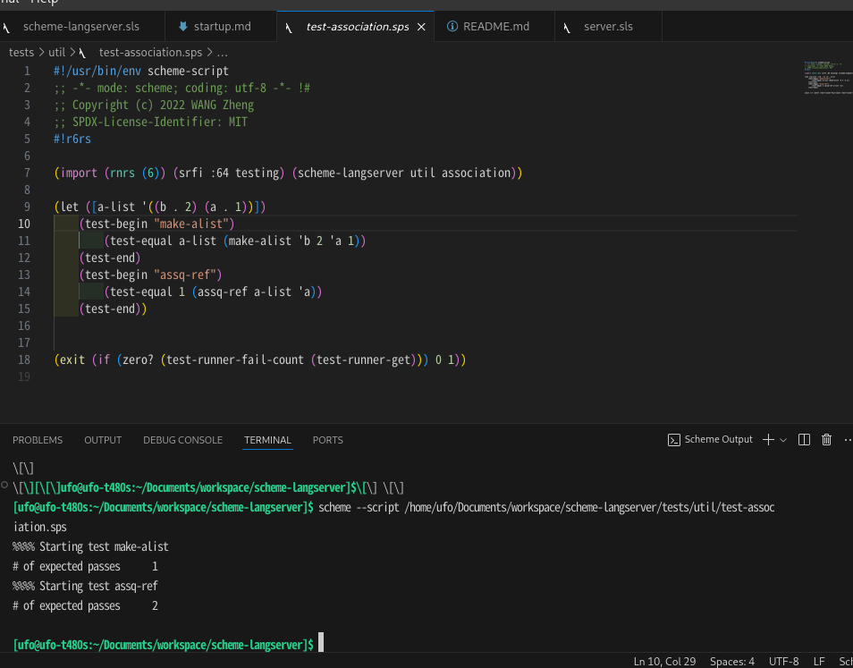
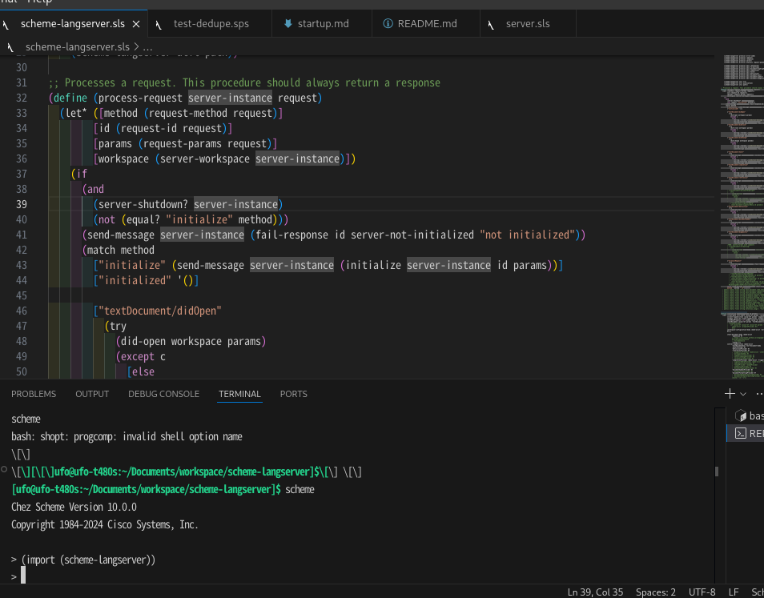
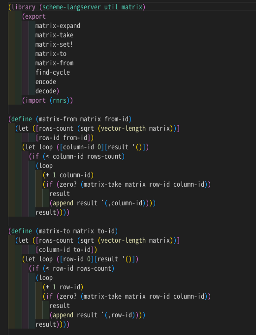

# Magic Scheme 

This extension adds support for Scheme(r6rs standard) to VS Code. With the help of [scheme-langserver](https://github.com/ufo5260987423/scheme-langserver), we're proud to say that Magic Scheme is **much better** than many counterparts, which includes even Racket extensions.

## Features

Magic Scheme **does**

- Support Scheme LSP through [scheme-langserver](https://github.com/ufo5260987423/scheme-langserver), which brings jump to definition, auto complete, type inference(early stage) and more. Especially, Magic Scheme can handle local identifiers and partial evaluation technique, which are not provided by many counterparts.
- Support Scheme project with through [AKKU](https://akkuscm.org/), which make you possible to load project depdendencies in REPL or directly run scheme script in terminal.
- Support highlighting of nearly all of the r6rs standard functions and Chez Scheme functions.

### LSP
Magic Scheme now supports [scheme-langserver](https://github.com/ufo5260987423/scheme-langserver). The current features are:

- Jump to definition
- Auto complete

Especially, I must first recommend you with [scheme-langserver](https://github.com/ufo5260987423/scheme-langserver)'s magic local identifier handling. Because in many other counterparts, you can never goto local binding's definition like the `a` in following:

```scheme
(let ([a 1])
 a
)
```

In further, thorough [scheme-langserver](https://github.com/ufo5260987423/scheme-langserver), Magic Scheme can auto complete `a` with `a-full-name-identifier` in such cases:

```scheme
(let ([a-full-name-identifier 1])
 a
)
```

I'm working on providing more details in this section: stay tuned!

### Scheme Project

You can directly run scheme script with project environment after typing <kbd>Alt+Shift+Enter</kbd>, or you may <kbd>Ctrl+Shift+P</kbd> and input command `magic-scheme.runSchemeScript`; The result shows `scheme --script ${currentFile}`:



You can directly load scheme project environment in REPL after typing <kbd>Alt+Shift+Enter</kbd>, or you may <kbd>Ctrl+Shift+P</kbd>  and input command `magic-scheme.runSchemeRepl`; The result shows an REPL and you may import AKKU managed environemnts without further configurations.



### Syntax Highlighting



## Setting Up

The followings are mainly focus on x64-based linux operating system. As for other OSs, you may notice the following tips:
1. If you're using nixos, you may directly search scheme-langserver [here](https://search.nixos.org/packages?channel=unstable&show=akkuPackages.scheme-langserver&from=0&size=50&sort=relevance&type=packages&query=akkuPackages.scheme-langserver). it will directly install an executable binary file. And this file is softly linked in bash $PATH as `scheme-langserver`.
2. If you're using MacOS, Windows or any other related environments, I suppose you're an advanced user and you may refer [scheme-langserver's documentation](https://github.com/ufo5260987423/scheme-langserver) in order to compile scheme-langserver manually.
3. Chez Scheme has Windows and MacOS version, but I've never tested them. So, I mean for Windows, you'd better use WSL/WSL2; for MacOS, it seems not very different from Linux.
4. AKKU is not native on Windows.
5. For nixos, you may be able to directly install all your needs.
6. Any other corner cases, you may refer softwares' documentations.

### Disable Conflict Plugins

I'm so sorry Magic Scheme has some conficts with [Chez-Scheme-VsCode](https://github.com/abhi18av/Chez-Scheme-VsCode) plugin. So, maybe you need to disable it.

### Get Scheme-langserver

You may directly download latest executable file [here](https://github.com/ufo5260987423/scheme-langserver/releases/latest/download/run). This file you may memory its path as `{path-to-run}`.

### Get Scheme
Magic Scheme supports [r6rs](http://r6rs.org/) standard scheme. But apparently I can't fully tests all implementations. As myself, I recommend with [Chez Scheme](https://cisco.github.io/ChezScheme/), and you may install it as following:

```bash
wget https://github.com/cisco/ChezScheme/releases/download/v10.0.0/csv10.0.0.tar.gz
tar -xf csv10.0.0.tar.gz && cd csv10.0.0
# Install dependencies: `libncurses5-dev`
./configure --threads --kernelobj --disable-x11
make && sudo make install
```

### Get AKKU

[AKKU](https://akkuscm.org/) is a package manager for Scheme. It grabs hold of code and shakes it vigorously until it behaves properly. Magic Scheme facilitates AKKU to manage scheme projects. To install AKKU, you may follow:

```bash
wget https://gitlab.com/-/project/6808260/uploads/094ce726ce3c6cf8c14560f1e31aaea0/akku-1.1.0.amd64-linux.tar.xz
tar -xf akku-1.1.0.amd64-linux.tar.xz && cd akku-1.1.0.amd64-linux
bash install
```

## Configurations

Include if your extension adds any VS Code settings through the `contributes.configuration` extension point.

For example:

This extension contributes the following settings:

* `myExtension.enable`: Enable/disable this extension.
* `myExtension.thing`: Set to `blah` to do something.

## Known Issues

Calling out known issues can help limit users opening duplicate issues against your extension.

## Release Notes

Users appreciate release notes as you update your extension.

### 1.0.0

Initial release of ...

### 1.0.1

Fixed issue #.

### 1.1.0

Added features X, Y, and Z.

---

## Following extension guidelines

Ensure that you've read through the extensions guidelines and follow the best practices for creating your extension.

* [Extension Guidelines](https://code.visualstudio.com/api/references/extension-guidelines)

## Working with Markdown

You can author your README using Visual Studio Code. Here are some useful editor keyboard shortcuts:

* Split the editor (`Cmd+\` on macOS or `Ctrl+\` on Windows and Linux).
* Toggle preview (`Shift+Cmd+V` on macOS or `Shift+Ctrl+V` on Windows and Linux).
* Press `Ctrl+Space` (Windows, Linux, macOS) to see a list of Markdown snippets.

## For more information

* [Visual Studio Code's Markdown Support](http://code.visualstudio.com/docs/languages/markdown)
* [Markdown Syntax Reference](https://help.github.com/articles/markdown-basics/)

**Enjoy!**

## NOTE
1. For Nixos, after install yo and generator-code, should 
```bash 
export PATH=$PATH:./node_modules/.bin/
```