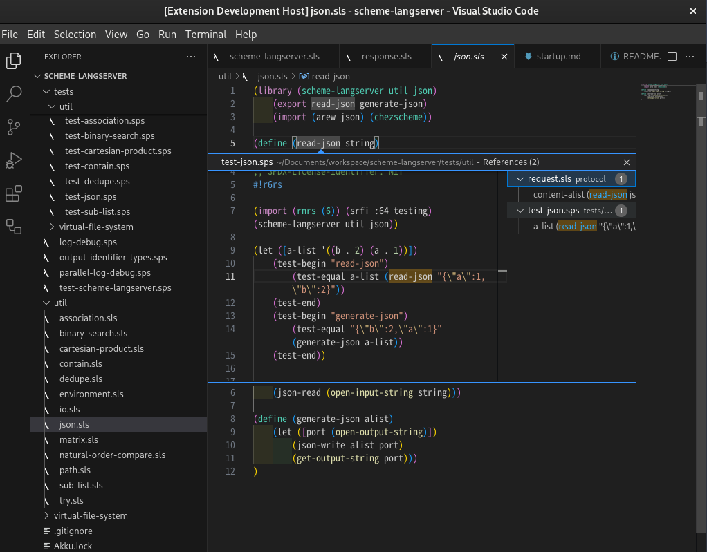
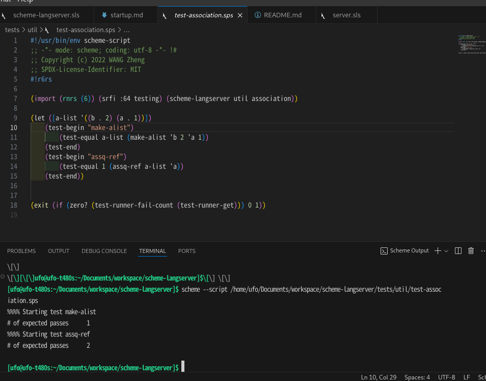
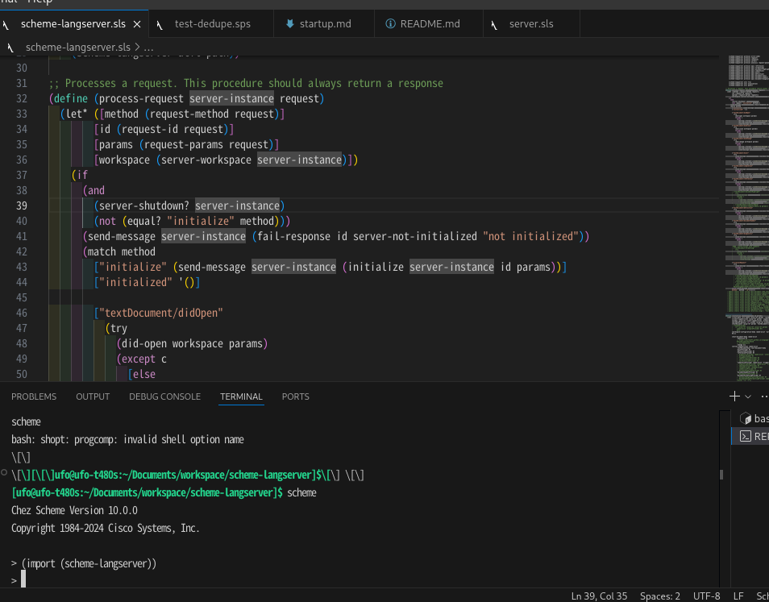
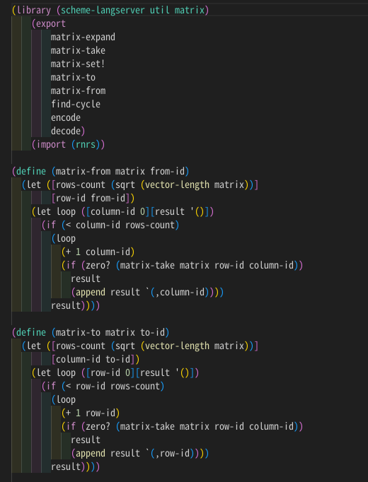

# Magic Scheme 

MORE DETAIL PLEASE REFER [GITHUB PAGE](https://github.com/ufo5260987423/magic-scheme).

This extension adds support for Scheme(r6rs standard) to VS Code. With the help of [scheme-langserver](https://github.com/ufo5260987423/scheme-langserver), we're proud to say that Magic Scheme is **much better** than many counterparts, which includes even Racket extensions.

>NOTE: PLEASE ALWAYS USE LATEST VERSION SCHEME-LANGSERVER.

> **Zero-config for Linux x64**: Magic Scheme can now **automatically download and install** `scheme-langserver` on first activation. No manual setup required for most Linux users.
>
> For macOS, Windows, ARM Linux, and NixOS users, please see [platform-specific notes](#setting-up--some-configuration) below.

You can click [this patreon page](https://www.patreon.com/PoorProgrammer/membership) or [爱发电](https://afdian.com/a/ufo5260987423) to donate monthly, or just donate 10 USD just once time with the following paypal link. 

[](https://www.paypal.com/paypalme/ufo5260987423/10)

## Release
0.0.6 Be compatible with new Scheme-langserver[<=2.0.0] !
0.0.5 OK, at least I removed the annoying surrounding pair with "'" and also, 0.0.4 works now!
0.0.4 Try to notice programmers when LSP is initializing.
0.0.3 Replace grammer configuration.
0.0.2 Fix: comment.
0.0.1 Start!

## Features

Magic Scheme **does**

- Support Scheme LSP through [scheme-langserver](https://github.com/ufo5260987423/scheme-langserver), which brings jump to definition, auto complete, type inference(early stage) and more. Especially, Magic Scheme can handle local identifiers and partial evaluation technique, which are not provided by many counterparts.
- Support Scheme project with through [AKKU](https://akkuscm.org/), which make you possible to load project depdendencies in REPL or directly run scheme script in terminal.
- Support highlighting of nearly all of the r6rs standard functions and Chez Scheme functions.

### LSP
Magic Scheme now supports [scheme-langserver](https://github.com/ufo5260987423/scheme-langserver). The current features are:

- Jump to definition

Especially, I must first recommend you with [scheme-langserver](https://github.com/ufo5260987423/scheme-langserver)'s magic local identifier handling. Because in many other counterparts, you can never goto local binding's definition like the `a` in following:

```scheme
(let ([a 1])
 a
)
```

- Auto complete

In further, thorough [scheme-langserver](https://github.com/ufo5260987423/scheme-langserver), Magic Scheme can auto complete `a` with `a-full-name-identifier` in such cases:

```scheme
(let ([a-full-name-identifier 1])
 a
)
```

- Find references


- Hover

Scheme-langserver truly responds with results, however, VS Code doesn't always display them.

I'm working on providing more details in this section: stay tuned!

### Scheme Project

You can directly run scheme script with project environment after typing <kbd>Alt+Enter</kbd>, or you may <kbd>Ctrl+Shift+P</kbd> and input command `magic-scheme.runSchemeScript`; The result shows `scheme --script ${currentFile}`:



You can directly load scheme project environment in REPL after typing <kbd>Alt+Shift+Enter</kbd>, or you may <kbd>Ctrl+Shift+P</kbd> and input command `magic-scheme.runSchemeREPL`; The result shows an REPL and you may import AKKU managed environemnts without further configurations.



### Syntax Highlighting



## Setting Up & Some Configuration

The followings are mainly focus on x64-based linux operating system. As for other OSs, you may notice the following tips:
1. If you're using nixos, you may directly search scheme-langserver [here](https://search.nixos.org/packages?channel=unstable&show=akkuPackages.scheme-langserver&from=0&size=50&sort=relevance&type=packages&query=akkuPackages.scheme-langserver). it will directly install an executable binary file. And this file is softly linked in bash $PATH as `scheme-langserver`.
2. If you're using MacOS, Windows or any other related environments, I suppose you're an advanced user and you may refer [scheme-langserver's documentation](https://github.com/ufo5260987423/scheme-langserver) in order to compile scheme-langserver manually.
3. Chez Scheme has Windows and MacOS version, but I've never tested them. So, I mean for Windows, you'd better use WSL/WSL2; for MacOS, it seems not very different from Linux.
4. AKKU is not native on Windows.
5. For nixos, you may be able to directly install all your needs.
6. Any other corner cases, you may refer softwares' documentations.

### NixOS Note

NixOS users should install `scheme-langserver` via `nixpkgs` (e.g., `akkuPackages.scheme-langserver`) rather than downloading the generic Linux release binary from GitHub. The generic glibc-linked binary crashes on NixOS with a SIGSEGV. The extension will automatically fall back to `scheme-langserver` in `$PATH` or a local `./run` file.

### Disable Conflict Plugins

I'm so sorry Magic Scheme has some conflicts with [Chez-Scheme-VsCode](https://github.com/abhi18av/Chez-Scheme-VsCode) plugin. So, maybe you need to disable it.

### Get Scheme-langserver

#### Automatic Installation (Recommended for Linux x64)

Magic Scheme will automatically download and install `scheme-langserver` on first activation if:
- You are on **Linux x64**
- `scheme-langserver` is not already on your `$PATH`
- `magicScheme.scheme-langserver.autoDownload` is enabled (default: `true`)

The binary is downloaded to VS Code's global storage (`~/.config/Code/User/globalStorage/...`) and is reused across workspaces.

#### Manual Installation

If automatic installation is not available for your platform, you can manually download the latest executable from the [scheme-langserver releases page](https://github.com/ufo5260987423/scheme-langserver/releases/latest) and set `magicScheme.scheme-langserver.serverPath` to its path.

| Platform | Support | Notes |
|----------|---------|-------|
| Linux x64 | ✅ Auto-download | Automatically downloaded on first use. |
| NixOS | ✅ Auto-download | Generic Linux binary; if it fails, install via `nix-shell -p akkuPackages.scheme-langserver`. |
| macOS | ❌ Manual only | No prebuilt binary. Install via Nix or [build from source](https://github.com/ufo5260987423/scheme-langserver). |
| Windows | ❌ Manual only | No prebuilt binary. Use WSL2 or build from source. |
| Linux ARM | ❌ Manual only | No prebuilt binary. Build from source. |

### Get Scheme
Magic Scheme supports [r6rs](http://r6rs.org/) standard scheme. But apparently I can't fully tests all implementations. As myself, I recommend with [Chez Scheme](https://cisco.github.io/ChezScheme/), and you may install it as following:

```bash
wget https://github.com/cisco/ChezScheme/releases/download/v10.0.0/csv10.0.0.tar.gz
tar -xf csv10.0.0.tar.gz && cd csv10.0.0
# Install dependencies: `libncurses5-dev`
./configure --threads --kernelobj --disable-x11
make && sudo make install
```

### Get AKKU

[AKKU](https://akkuscm.org/) is a package manager for Scheme. It grabs hold of code and shakes it vigorously until it behaves properly. Magic Scheme facilitates AKKU to manage scheme projects. To install AKKU, you may follow:

```bash
wget https://gitlab.com/-/project/6808260/uploads/094ce726ce3c6cf8c14560f1e31aaea0/akku-1.1.0.amd64-linux.tar.xz
tar -xf akku-1.1.0.amd64-linux.tar.xz && cd akku-1.1.0.amd64-linux
bash install
```

## For Developer

### Setup (NixOS)

1. For Nixos, after install yo and generator-code, should 
```bash 
export PATH=$PATH:./node_modules/.bin/
```

### Testing

The project has a 3-layer test suite:

| Suite | File | Description |
|-------|------|-------------|
| Unit | `src/test/utils.test.ts`, `src/test/download.test.ts` | Tests pure logic: `getOrDefault`, `quoteWindowsPath`, config defaults, download progress, and platform detection. |
| Mock LSP | `src/test/lifecycle.test.ts` | Uses a mock Node.js LSP server (`src/test/mock-server/server.ts`) to test extension activation, completions, and hover without a real scheme-langserver. |
| E2E | `src/test/e2e.test.ts` | Tests against a real `scheme-langserver` binary. Auto-detects the binary from `.vscode-test/scheme-langserver`, `./run`, or `$PATH`. |

Run all tests:
```bash
npm run test
```

Run a specific label:
```bash
npx @vscode/test-cli --label unit
npx @vscode/test-cli --label mock-lifecycle
npx @vscode/test-cli --label e2e
```

### Known Issues / Technical Notes

- **`$/setTrace` warning**: VS Code's LSP client sends `$/setTrace` (a standard LSP 3.16+ notification to adjust server trace verbosity). `scheme-langserver` does not implement this and returns `invalid request`. This is harmless and does not affect completions, hover, or any other LSP feature.
- **NixOS `scheme-langserver` binary**: The generic Linux glibc-linked release binary crashes on NixOS. Use the `nixpkgs` build instead.
- **Test `sleep(2000)`**: `src/test/helper.ts` uses a fixed 2-second delay after opening a document to wait for LSP initialization. This is stable but could be improved by listening for `State.Running`.
- **Mock server edge cases**: The mock LSP server does not handle `stdin` `end`/`error` events. This is acceptable for current test scenarios.
